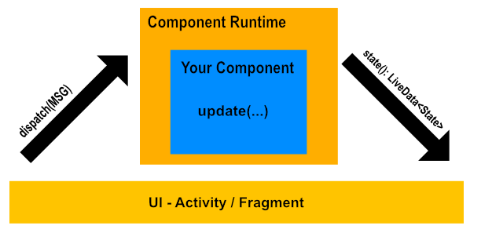

# Elmdroid

This library helps you implement [The Elm Architecture(TEA)][tea] on Android. This well known unidirectional architecture
is incredibly easy to use but not so simple to set up and that's why we created this library. To make things even simpler,
we added integration with `RxJava`, `LiveData`, and optionally also `ViewModel`.

## Basic concepts
This is not an introduction guide to [TEA][tea], if you are not familiar with it or with similar unidirectional
architectures we strongly recommend to read the [TEA docs][tea].

Basically the only thing you have to implement is interface `Component<STATE : State, MSG : Msg, CMD : Cmd>` which
is then wrapped inside `ComponentRuntime`. Look at the picture below to see how is your component integrated with rest of the app:



`ComponentRuntime` just receives messages from UI and translates them into the from of new states,
using `Component.update(..)` function.
UI then simply observes state `LiveData<State>` and renders the changes.

## Usage

### Basic synchronous example

Let's say we want to implement simple screen with two buttons for increment/decrement actions and plain `TextView`
to keep track of current "score". You can find this example in [official elm examples][elm-simple-example]

First we have to define state. That can be simply represented as an Kotlin data class. There is nothing interesting about it,
it just holds the current "score" for our counter:

```kotlin
data class CounterState(val counter: Int) : State
```

Now let's define messages(Msg). You can think about it as defining all the possible events that can
happen on a screen:

```kotlin
sealed class CounterMsg : Msg
object Increment : CounterMsg()
object Decrement : CounterMsg()
```

Now when we have all the basic building blocks defined, we can put everything together in `CounterComponent`:

```kotlin
class CounterComponent: SimpleComponent<CounterState, CounterMsg> {
    override fun initState(): CounterState = CounterState(0)

    override fun simpleUpdate(msg: CounterMsg, prevState: CounterState): CounterState = when(msg){
        is Increment -> CounterState(prevState.counter + 1)
        is Decrement -> CounterState(prevState.counter - 1)
    }
}
```

`SimpleComponent` is simplified version of `Component` created for purely synchronous usage.
Most important part is `simpleUpdate(msg, prevState)` function. It takes incoming
message with previous state and defines a new state to render. `initState()` simply defines what should be
the original state before any `Msg` arrives.

With prepared component, we can simply use it in our activity or fragment:

```kotlin
class CounterActivity : AppCompatActivity() {

    private lateinit var runtime: ElmRuntime<CounterState, CounterMsg, Nothing>

    override fun onCreate(savedInstanceState: Bundle?) {
        super.onCreate(savedInstanceState)
        setContentView(R.layout.activity_counter)
        supportActionBar?.title = getString(R.string.basic_counter)

        runtime = ElmRuntime(CounterComponent())

        runtime.state().observe(this, Observer {
            it?.let { counter.text = "${it.counter}" }
        })

        increment.setOnClickListener { runtime.dispatch(Increment) }
        decrement.setOnClickListener { runtime.dispatch(Decrement) }
    }

    override fun onDestroy() {
        super.onDestroy()
        runtime.clear()
    }
}
```

We need to wrap our component in `ElmRuntime` which gives you ability to observe current state as `LiveData`
and to dispatch `Increment` and `Decrement` messages. Make sure you call `clear()`
on runtime in `onDestroy()` to prevent memory leaks.

If you want your component to survive configuration change you have to handle it yourself or you can use
`ElmViewModel` and pass in your component:

```kotlin
class CounterViewModel : ElmComponentViewModel<CounterState, CounterMsg, Nothing>(CounterComponent())
```

or extend `ElmBaseViewModel` and implement your component logic right inside the subclass.
Either way, your component will survive configuration change inside it's `ViewModel` a the `ElmRuntime.clear()`
will be called in `ViewModel.onCleared()` for you. You can then use your `ViewModel` in Activity/Fragment the same way
we used runtime above because `ElmComponentViewModel` is essentially just an implementation of runtime:

```kotlin
class CounterActivity : AppCompatActivity() {

    private lateinit var viewModel: CounterViewModel

    override fun onCreate(savedInstanceState: Bundle?) {
        super.onCreate(savedInstanceState)
        setContentView(R.layout.activity_counter)
        supportActionBar?.title = getString(R.string.basic_counter)

        viewModel = ViewModelProviders.of(this).get(CounterViewModel::class.java)

        viewModel.state().observe(this, Observer {
            it?.let { counter.text = "${it.counter}" }
        })

        increment.setOnClickListener { runtime.dispatch(Increment) }
        decrement.setOnClickListener { runtime.dispatch(Decrement) }
    }
}
```

You can check complete counter sample in [samples][counter-sample]

### Commands and Subscriptions

If you want to perform asynchronous action you have two options: start one time async task
with a `Cmd` that returns a single result `Msg` back to your update function or you can set up
a `Subscription` and listen to continuous stream of messages.

#### Commands

All commands starts tasks. Task is simple function that returns RxJava `Single<Msg>`. For example this login Task:
```kotlin
fun loginTask(email: String, password: String): Single<LoginMsg> {
    val repo = UserRepository()
    repo.loginUser(email, password)
    return Single.just(repo.getUser())
}
```

To start this task your update function needs to return some `Cmd`

```kotlin
override fun update(msg: LoginMsg, prevState: LoginState): Pair<LoginState, LoginCmd?> = when(msg) {
        is LoginClicked ->      prevState.copy(loadingVisible = true, loginEnabled = false, msgText = "") withCmd LoginAction(prevState.email, prevState.password)
        is LoginSuccess ->      prevState.copy(loadingVisible = false, msgText = "Login Successful, welcome ${msg.username}", email = "", password = "").updateLogin().noCmd()
}
```

*Notice we use standard `update` function from normal `Component` interface and not the "simple" versions. The only difference is that
our `update` function is now returning not just the new state but also possible `Cmd` to start some new async tasks.*

After `LoginClicked` message arrives we return state with `loading = true` and we also use `withCmd` to return
`LoginAction` `Cmd` with it. This is the way to specify immediate state change and async action that should
fallow. We need to define the last missing peace, the `call()` function that defines which `Cmd` starts which
Task.

```kotlin
override fun call(cmd: LoginCmd): Single<LoginMsg> = when(cmd) {
        is LoginAction -> loginTask(cmd.email, cmd.password)
}
```

`call()` function specifies how to handle every `Cmd` that drops out of the `update()` function.
Our `loginTask` returns `LoginSuccess` and this message is run through the `update()`
function again to finally display some logged in state.

#### Subscriptions

You can define two types of subscriptions
1. `StatelessSub` - Simply starts during `ComponentRuntime` creation and ends when `ComponentRuntime` is cleared.
It is not effected by any state changes.
2. `StatefulSub` - It has the same lifetime but it's given the opportunity to change anytime the state is changed.
It can even define it's own filter policy, so it can be interested only in some particular state changes.

Example of Stateless subscription could be this LoginSubscription that notifies update function with a new
message anytime logged user changed. It takes the information about the logged user from the repository not
form the current view state and that's why it's `Stateless` it has no interest in state and it's not
influenced by it in any way. Here is how this subscription might look like:

```kotlin
class UserSubscription : StatelessSub<LoginState, LoginMsg>() {
    override fun invoke(): Observable<LoginMsg> = UserRepository().getUser().map {
        LoggedUserChanged(it.username)
    }
}
```

It is simply an object that extends `StatelessSub` and overrides `invoke()` function that returns stream of
messages represented in a form of Observable.

Now let's say we want a similar sub that would emmit `Tick` event every second after some user logged in.
This subscription will take choose the view state object as it's source of truth about the logged in user and
that's why we call it `Stateful`

```kotlin
class CounterSubscription : StatefulSub<LoginState, LoginMsg>() {
    override fun invoke(state: LoginState): Observable<LoginMsg> = when {
        state.loggedUsername.isNotBlank() -> Observable.interval(1, TimeUnit.SECONDS).map { Tick }
        else -> Observable.empty()
    }
    override fun isDistinct(s1: LoginState, s2: LoginState) = s1.loggedUsername != s2.loggedUsername
}
```

As you can see, the super class is now called `StatefulSub` but also the `invoke(state)` function now takes
state as a parameter so your stream of data will be restarted every time new state comes out. The last question
is what does the 'new' mean exactly. If you don't override `isDistinct` it uses the default implementation
that filters only the states that are equal (using `equals()` method) to the previous state or you can override it
and choose your own rules for equality. As you can see in this example, we are only interested in new view states
if they have different loggedUsername than the previous state.


Check out [samples][samples] to explore even more complex solutions.

## Download

Download via jitpack for now

Add it in your root build.gradle at the end of repositories:
```groovy
allprojects {
    repositories {
        ...
        maven { url 'https://jitpack.io' }
    }
}
```

And add the dependency:
```groovy
dependencies {
    implementation 'com.github.InventiDevelopment:Elmdroid:v0.3.2'
}
```

jcenter and mavenCentral upload is in progress :)


## License

    Copyright 2017 INVENTI Development s.r.o.

    Licensed under the Apache License, Version 2.0 (the "License");
    you may not use this file except in compliance with the License.
    You may obtain a copy of the License at

       http://www.apache.org/licenses/LICENSE-2.0

    Unless required by applicable law or agreed to in writing, software
    distributed under the License is distributed on an "AS IS" BASIS,
    WITHOUT WARRANTIES OR CONDITIONS OF ANY KIND, either express or implied.
    See the License for the specific language governing permissions and
    limitations under the License.


[tea]: https://guide.elm-lang.org/architecture/
[arch]: https://developer.android.com/topic/libraries/architecture/index.html
[elm-simple-example]: http://elm-lang.org/examples/buttons
[counter-sample]: https://github.com/InventiDevelopment/Elmdroid/tree/dev/sample/src/main/java/com/example/elmdroid/counter
[samples]: https://github.com/InventiDevelopment/Elmdroid/tree/master/sample/src/main/java/com/example/elmdroid